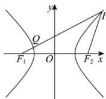

> [!faq]- 全练一本通解析
> **【答案】** (1,2]
>
> **【解析】**
> 因为 $\left|PF_2\right| + \left|QF_1\right| = \left|PQ\right|$ ，且 $\left|PF_1\right| - \left|PF_2\right| = 2$ ，所以 $\left|PF_1\right| - \left(\left|PQ\right| - \left|QF_1\right|\right) = 2\left|QF_1\right| = 2a$ 所以 $\left|QF_1\right| = a$ ，由于 $\left|QF_1\right|\geq c - a$ ，所以 $c - a\leq a$ ，解得 $e = \frac{c}{a}\leq 2$ ，所以 $e\in (1,2]$ .故答案为：(1,2]
> 
