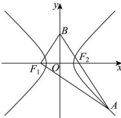

<!-- question-source:start -->
【70】（2024·陕西西安二模）如图，已知双曲线 C: $\frac{x^{2}}{a^{2}} - \frac{y^{2}}{b^{2}} = 1 (a > 0, b > 0)$ 的左、右焦点分别为 $F_{1}(-c, 0)$ $F_{2}(c, 0)$ ，点 A 在 C 上，点 B 在 y 轴上，A, $F_{2}$ , B 三点共线，若直线 $BF_{1}$ 的斜率为 $\sqrt{3}$ ，直线 $AF_{1}$ 的斜率为 $-\frac{5\sqrt{3}}{11}$ ，则双曲线 C 的离心率是（）

A. $\frac{\sqrt{5}}{2}$ B. $\frac{3}{2}$ C. $\sqrt{5}$ D. 3
<!-- question-source:end -->

![[Q00008439A1]]
