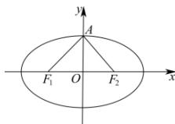

> [!faq]- 全练一本通解析
> **【答案】** C
>
> **【解析】**
> 解析: 由题意可知 $\left|AF_{1}\right|=\left|AF_{2}\right|=\sqrt{\left|OA\right|^{2}+\left|F_{1}O\right|^{2}}=\sqrt{b^{2}+c^{2}}=a$ , $\left|F_{1}F_{2}\right|=2c$ , 在 $\triangle AF_{1}F_{2}$ 中, 由余弦定理得 $4c^{2}=a^{2}+a^{2}-2a^{2}\cos\angle F_{1}AF_{2}$ , 化简得 $4c^{2}=\frac{1}{3}a^{2}$ , 则 $e^{2}=\frac{1}{12}$ , 所以 $e=\frac{\sqrt{3}}{6}$ , 故选: C.
> 
