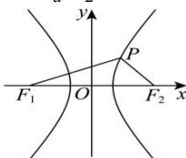

> [!faq]- 全练一本通解析
> **【答案】** B
>
> **【解析】**
> 解析: 设双曲线 C 的半焦距为 $c(c>0)$ .
> 由题意, 点 P 在双曲线 C 的右支上, $\left|PF_{1}\right|=5,\left|PF_{2}\right|=3$ .
> 由余弦定理得 $\cos\angle F_{1}PF_{2}=\frac{\left|PF_{1}\right|^{2}+\left|PF_{2}\right|^{2}-\left|F_{1}F_{2}\right|^{2}}{2\left|PF_{1}\right|\left|PF_{2}\right|}=\frac{5^{2}+3^{2}-\left|F_{1}F_{2}\right|^{2}}{2\times5\times3}=-\frac{1}{2}$ 解得 $\left|F_{1}F_{2}\right|=7$ , 即 2c=7 , 得 $c=\frac{7}{2}$ ,
> 根据双曲线定义得 $\left|PF_{1}\right|-\left|PF_{2}\right|=2a=2$ , 解得 a=1 , 故双曲线 C 的离心率 $e=\frac{c}{a}=\frac{7}{2}$ . 故选:B.
> 
