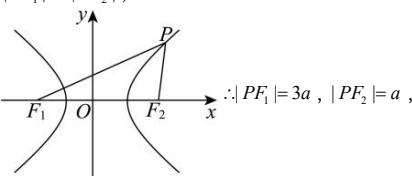

> [!faq]- 全练一本通解析
> **【答案】** C
>
> **【解析】**
> 解析:根据题意可知点 P 在右支上, 则 $\left|PF_{1}\right|-\left|PF_{2}\right|=2a$ , 又 $\left|PF_{1}\right|=3\left|PF_{2}\right|$ ,
> 
> ∴ $\left|F_{1}F_{2}\right|=2c$ ，则在 $\triangle PF_{1}F_{2}$ 中， $\cos\angle F_{1}PF_{2}=\frac{9a^{2}+a^{2}-4c^{2}}{2\cdot3a\cdot a}=\frac{1}{6}$ ∴ 3a=2c，故 $e=\frac{c}{a}=\frac{3}{2}$ .
>
> 故选 **C**.
