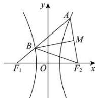

> [!faq]- 全练一本通解析
> **【答案】** D
>
> **【解析】**
> 解析:由题意可知线段 $AF_{2}$ 的中点为 M，且满足 $BM \perp AF_{2}$ ，则 $|AB| = |BF_{2}|$ ，
> 故 $\triangle ABF_{2}$ 为等腰三角形，
> 又 $\angle F_{1}AF_{2}=\frac{\pi}{3}$ ，则 $\triangle ABF_{2}$ 为正三角形，
> 根据双曲线定义知 $\left|AF_{1}\right|-\left|AF_{2}\right|=2a=\left|AF_{1}\right|-\left|AB\right|=\left|BF_{1}\right|$ 设 $\left|AB\right|=x$ ，则 $\left|BF_{2}\right|-\left|BF_{1}\right|=2a\Rightarrow x=4a$
> 
> 在 $\triangle AF_1F_2$ 中，由余弦定理知
> $\cos 60^{\circ} = \frac{(x + 2a)^{2} + x^{2} - 4c^{2}}{2x(x + 2a)} = \frac{52a^{2} - 4c^{2}}{48a^{2}} = \frac{1}{2}\Rightarrow e = \sqrt{7}$ ，
>
> 故选 **D**
