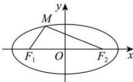

> [!faq]- 全练一本通解析
> **【答案】** C
>
> **【解析】**
> 解析：由题知 $M$ 在 $x$ 轴上方，直线 $F_{1}M$ 的斜率为 $\sqrt{3}$ ，则 $\angle MF_1F_2 = 60^\circ$ ， $\cos \angle MF_1F_2 = \frac{1}{2}$ 由 $\left|F_1F_2\right| = 2c$ ， $\frac{\left|MF_2\right|}{\left|F_1F_2\right|} = \frac{7}{8}$ 得 $\left|MF_2\right| = \frac{7}{4} c$
> 
> 所以由椭圆的定义有 $\left|MF_1\right| = 2a - \left|MF_2\right| = 2a - \frac{7}{4} c$ 在 $\triangle MF_1F_2$ 中，由余弦定理得 $\cos \angle MF_1F_2 = \frac{1}{2} = \frac{4c^2 + \left(2a - \frac{7}{4}c\right)^2 - \frac{49}{16}c^2}{2\times 2c\times\left(2a - \frac{7}{4}c\right)}$ 整理得 $15c^{2} - 22ac + 8a^{2} = 0$ ，得 $15e^{2} - 22e + 8 = 0$ ，即 $(5e - 4)(3e - 2) = 0$ 解得 $e = \frac{4}{5}$ 或 $\frac{2}{3}$ ，故椭圆 $C$ 的离心率为 $\frac{4}{5}$ 或 $\frac{2}{3}$ .
>
> 故选 **C**.
