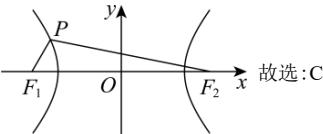

> [!faq]- 全练一本通解析
> **【解析】**
> C解析：令双曲线 $C$ 的焦距为 $2c$ ，依题意， $\left\{ \begin{array}{l}\left|PF_{2}\right| - \left|PF_{1}\right| = 2a\\ \left|PF_{2}\right| + \left|PF_{1}\right| = 6a - 2c \end{array} \right.$ ，解得 $\left\{ \begin{array}{l}\left|PF_1\right| = 2a - c\\ \left|PF_2\right| = 4a - c \end{array} \right.$ 在 $\triangle PF_1F_2$ 中， $\angle PF_1F_2 = 60^\circ$ ，由余弦定理得 $(4a - c)^2 = 4c^2 +(2a - c)^2 -2\times 2c\times (2a - c)\times \frac{1}{2},$ 整理得 $c = \sqrt{2} a$ ，所以双曲线 $C$ 的离心率为： $\sqrt{2}$
> $$
> c = \sqrt {2} a
> $$
> $$
> \sqrt {2}
> $$
> 
