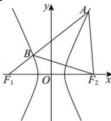

> [!faq]- 全练一本通解析
> **【答案】** D
>
> **【解析】**
> 解析：
> 
> 不妨设 A 在右支，则 $\left|AB\right|=\left|AF_{2}\right|=\left|BF_{2}\right|=m$ ，又 $\because\left|AF_{1}\right|-\left|AF_{2}\right|=2a$ ，则 $\left|AB\right|+\left|BF_{1}\right|-\left|AF_{2}\right|=2a,\therefore\left|BF_{1}\right|=2a,\left|BF_{2}\right|=4a,\angle ABF_{2}=60^{\circ},$ $\angle F_{1}BF_{2}=120^{\circ}$ $\therefore F_{1}F_{2}^{2}=BF_{1}^{2}+BF_{2}^{2}-2BF_{1}\cdot BF_{2}\cos120^{\circ},$ $\therefore 4c^{2}=4a^{2}+16a^{2}-2\cdot2a\cdot4a\left(-\frac{1}{2}\right)=28a^{2}$ ，即 $c^{2}=7a^{2}$ ，由 e>1， $\therefore e=\sqrt{7}$
>
> 故选 **D**.
