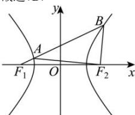

> [!faq]- 全练一本通解析
> **【答案】** D
>
> **【解析】**
> 解析：∵ $\overrightarrow{F_{1}B}=6\overrightarrow{F_{1}A}$ ，∴ A、B、 $F_{1}$ 三点共线，
> 设 $\left|\overrightarrow{F_{1}B}\right|=6\left|\overrightarrow{F_{1}A}\right|=6m$ ，由双曲线定义得 $BF_{2}=6m-2a, AF_{2}=2a+m$ 所以 AB=6m-m=5m，∵ $AF_{2}\perp BF_{2}$ ，∴ $AB^{2}=BF_{2}^{2}+AF_{2}^{2}$ 即 $(5m)^{2}=(6m-2a)^{2}+(2a+m)^{2}$ ，解得 $m=\frac{2a}{3}$ 或 m=a，
> 由 $\left|\overline{AF_{2}}\right|>\left|\overline{BF_{2}}\right|$ ，则 $2a+m>6m-2a$ ，得 $m<\frac{4a}{5}$ ，所以 $m=\frac{2a}{3}$ ，
> ∴ $\cos\angle ABF_{2}=\frac{BF_{2}}{AB}=\frac{3}{5}=\cos\angle F_{1}BF_{2}=\frac{(4a)^{2}+(2a)^{2}-4c^{2}}{2\times4a\times2a}$ ，解得 $e=\frac{\sqrt{65}}{5}$ ，
> 故选：D.
> 
