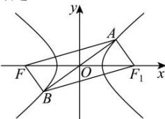

> [!faq]- 全练一本通解析
> **【答案】** D
>
> **【解析】**
> 解析:不妨设 $F, F_{1}$ 分别为双曲线的左右焦点, 连接 $AF_{1}, BF_{1}$ ,
> 因为 A, B 两点关于原点对称, 所以 $AFBF_{1}$ 为平行四边形, 所以 $\left|FB\right|=\left|AF_{1}\right|$ 因为 $\left|FA\right|-\left|AF_{1}\right|=2a,\left|\overrightarrow{FA}\right|=2\left|\overrightarrow{FB}\right|=2\left|AF_{1}\right|$ 所以 $\left|\overline{FA}\right|=4a,\left|AF_{1}\right|=2a$ 因为 $\overrightarrow{FA} \cdot \overrightarrow{FB} = \left|\overrightarrow{FA}\right| \cdot \left|\overrightarrow{FB}\right| \cos \angle AFB = 3a^{2}$ ，所以 $\cos \angle AFB = \frac{3a^{2}}{8a^{2}} = \frac{3}{8}$ ;
> 在 $\triangle AFF_{1}$ 中，由余弦定理可得 $4c^{2}=16a^{2}+4a^{2}-2\times4a\times2a\cos\angle FAF_{1}$ 因为 $\cos\angle FAF_{1}=-\cos\angle AFB=-\frac{3}{8}$ ，所以 $26a^{2}=4c^{2}$ ，即 $e=\frac{\sqrt{26}}{2}$ .
> 故选:D
> 
