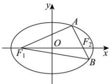

> [!faq]- 全练一本通解析
> **【答案】** D
>
> **【解析】**
> 解析: 由 $\overline{AF_{2}}=2\overline{F_{2}B}$ 可知 $\left|\overline{AF_{2}}\right|=2\left|\overline{F_{2}B}\right|$ ，设 $\left|\overline{F_{2}B}\right|=x$ ，则 $\left|\overline{AF_{2}}\right|=2x,\left|\overline{AF_{1}}\right|=2a-2x,\left|\overline{BF_{1}}\right|=2a-x,\left|AB\right|=3x,$ 则由余弦定理可得 $(3x)^{2}=(2a-2x)^{2}+(2a-x)^{2}-2(2a-2x)(2a-x)\times\frac{4}{5}$ 化简可得 $2a^{2}-3ax-9x^{2}=0\Rightarrow(a-3x)(2a+3x)=0$ ，故 a=3x, $2a=-3x$ （舍去），
> 又 $\cos\angle AF_{2}F_{1}+\cos\angle BF_{2}F_{1}=0$ 所以 $\frac{(2x)^{2}+4c^{2}-(2a-2x)^{2}}{2\cdot2x\cdot2c}+\frac{x^{2}+4c^{2}-(2a-x)^{2}}{2\cdot x\cdot2c}=0$ ，化简可得 $3c^{2}+4ax-3a^{2}=0\Rightarrow3c^{2}+4a\frac{a}{3}-3a^{2}=0\Rightarrow9c^{2}=5a^{2}$ ，故 $3c=\sqrt{5}a\Rightarrow e=\frac{\sqrt{5}}{3}$ ，故选:D
> 
