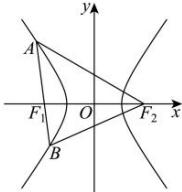

> [!faq]- 全练一本通解析
> **【答案】** C
>
> **【解析】**
> 解析:如图,
> 
> 由 $\sin \angle AF_1F_2 = 2\sin \angle AF_2F_1$ ， $\sin \angle BF_1F_2 = 3\sin \angle BF_2F_1$ 结合正弦定理得 $\left|AF_2\right| = 2\left|AF_1\right|$ ， $\left|BF_2\right| = 3\left|BF_1\right|$ 由双曲线的定义得 $\left|AF_2\right| - \left|AF_1\right| = 2a,\left|BF_2\right| - \left|BF_1\right| = 2a$ 所以 $\left|AF_2\right| = 4a,\left|AF_1\right| = 2a,\left|BF_2\right| = 3a,\left|BF_1\right| = a,\left|AB\right| = 3a$ 在 $\triangle ABF_{2}$ 中，由余弦定理，得 $\cos \angle BAF_{2} = \frac{9a^{2} + 16a^{2} - 9a^{2}}{2\times 3a\times 4a} = \frac{2}{3}$ 又因为 $|F_1F_2| = 2_c$ ，于是在 $\triangle AF_1F_2$ 中，由余弦定理得 $\cos \angle F_{1}AF_{2} = \frac{4a^{2} + 16a^{2} - 4c^{2}}{2\times 2a\times 4a} = \frac{2}{3}$ 整理得 $7a^2 = 3c^2$ 所以 $e = \frac{c}{a} = \sqrt{\frac{7}{3}} = \frac{\sqrt{21}}{3}$
>
> 故选 **C**.
