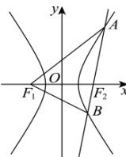

> [!faq]- 全练一本通解析
> **【答案】** B
>
> **【解析】**
> B解析：由 $\overline{AF_2} = 2\overline{F_2B}$ ，得 $\left|AB\right| = 3\left|BF_2\right|$ ，结合题设有 $\left|AF_1\right| = 3\left|BF_2\right|$ 由双曲线的定义知， $\left|AF_1\right| - \left|AF_2\right| = 2a$ ， $\left|BF_1\right| - \left|BF_2\right| = 2a$ ，又 $\left|AF_1\right| = \left|AB\right|$ 由 $\left\{ \begin{array}{l}\left|AF_1\right| - \left|AF_2\right| = 2a\\ \left|AF_1\right| = 3\left|BF_2\right|\\ \left|AF_2\right| = 2\left|BF_2\right| \end{array} \right.$ ，得 $\left|BF_2\right| = 2a$ ，得 $\left|BF_1\right| = 4a,\left|AF_1\right| = \left|AB\right| = 6a,$ 在 $\triangle ABF_{1}$ 中，由余弦定理，得 $\cos A = \frac{\left|AF_1\right|^2 + \left|AB\right|^2 - \left|BF_1\right|^2}{2\left|AF_1\right||AB} = \frac{36a^2 + 36a^2 - 16a^2}{2\cdot6a\cdot6a} = \frac{7}{9},$ 在 $\triangle AF_1F_2$ 中，由余弦定理，得 $\cos A = \frac{\left|AF_1\right|^2 + \left|AF_2\right|^2 - \left|F_1F_2\right|^2}{2\left|AF_1\right||AF_2|} = \frac{36a^2 + 16a^2 - 6^2}{2\cdot6a\cdot4a} = \frac{7}{9},$ 解得 $a = \frac{3\sqrt{33}}{11},$ 所以双曲线的离心率为 $e = \frac{c}{a} = \frac{3}{\frac{3\sqrt{33}}{11}} = \frac{\sqrt{33}}{3}$ 故选：B
> 
