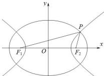

> [!faq]- 全练一本通解析
> **【答案】** B
>
> **【解析】**
> 解析:如图,设椭圆的长半轴长为 $a_{1}$ , 双曲线的半实轴长为 $a_{2}$
> 
> 则根据椭圆及双曲线的定义得： $\left|PF_{1}\right|+\left|PF_{2}\right|=2a_{1},\left|PF_{1}\right|-\left|PF_{2}\right|=2a_{2}$ $\left|PF_{1}\right|=a_{1}+a_{2},\left|PF_{2}\right|=a_{1}-a_{2}$ 设 $\left|F_{1}F_{2}\right|=2c,\angle F_{1}PF_{2}=60^{\circ}$ 则在 $\triangle PF_{1}F_{2}$ 中由余弦定理得： $\left|F_{1}F_{2}\right|^{2}=\left|PF_{1}\right|^{2}+\left|PF_{2}\right|^{2}-2\left|PF_{1}\right|\cdot\left|PF_{2}\right|\cos F_{1}PF_{2}$ 即 $4c^{2}=\left(a_{1}+a_{2}\right)^{2}+\left(a_{1}-a_{2}\right)^{2}-2\left(a_{1}+a_{2}\right)\cdot\left(a_{1}-a_{2}\right)\cos60^{\circ}$ 化简得： $a_{1}^{2}+3a_{2}^{2}=4c^{2}$ ，所以 $\frac{1}{e_{1}^{2}}+\frac{3}{e_{2}^{2}}=4(0<e_{1}<1,e_{2}>1)$ ，又因为双曲线的离心率为 $e_{2}=\sqrt{2}$ ，所以椭圆的离心率为 $e_{1}=\frac{\sqrt{10}}{5}$ ，
>
> 故选 **B**.
