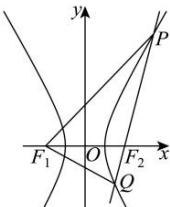

> [!faq]- 全练一本通解析
> **【答案】** C
>
> **【解析】**
> 解析: 令 $\left|QF_{1}\right|=m$ ，由 $\left|PF_{1}\right|\left|PQ\right|\left|QF_{1}\right|=2:2:1$ ，得 $\left|PF_{1}\right|=\left|PQ\right|=2m$ ，
> 
> 由双曲线的定义, 得 $\left|PF_{1}\right|-\left|PF_{2}\right|=\left|QF_{1}\right|-\left|QF_{2}\right|=2a$ , 则 $\left|PF_{2}\right|=2m-2a,\left|QF_{2}\right|=m-2a$ ,
> 而 $\left|PF_{2}\right|+\left|QF_{2}\right|=\left|PQ\right|=2m$ ，因此 $m=4a,\left|PF_{1}\right|=|PQ|=8a,\left|QF_{1}\right|=4a,\left|QF_{2}\right|=2a$
> 在等腰 $\triangle PQF_{1}$ 中， $\cos \angle F_{1}QF_{2} = \frac{\frac{1}{2}|QF_{1}|}{|PQ|} = \frac{1}{4}$ ，
> 令双曲线 $\frac{x^2}{a^2} -\frac{y^2}{b^2} = 1$ 的半焦距为 $c$
> 得： $\left|F_{1}F_{2}\right|^{2}=\left|QF_{1}\right|^{2}+\left|QF_{2}\right|^{2}-2\left|QF_{1}\right|\left|QF_{2}\right|\cos\angle F_{1}QF_{2}$
> 在 $\triangle QF_{1}F_{2}$ 中，由余弦定理
> 即 $(2c)^{2} = (4a)^{2} + (2a)^{2} - 2\cdot 4a\cdot 2a\cdot \frac{1}{4}$ ，整理得 $c^2 = 4a^2$ ，则 $e^2 = 4$
