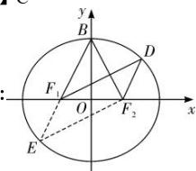

> [!faq]- 全练一本通解析
> **【答案】** C
>
> **【解析】**
> 解析：
> 
> 如图所示，
> 设 $D$ 关于原点对称的点为 $E$ ，则 $DF_{1}EF_{2}$ 为平行四边形，
> 由 $BF_{1}//DF_{2}$ 可知，B， $F_{1}$ ，E三点共线，且 $EF_{2}\perp BF_{2}$ ，
> 设 $EF_{1} = x$ ，则 $EF_{2} = 2a - x$ ，在 $\mathrm{Rt}\triangle EF_2B$ 中， $a^2 +\left(2a - x\right)^2 = (x + a)^2$ ，解得 $x = \frac{2}{3} a$
> 注意到 $\cos \angle EF_1F_2 = -\cos \angle BF_1F_2 = -\frac{c}{a}$
> 在 $\triangle EF_{1}F_{2}$ 中结合余弦定理可得， $-\frac{c}{a} = \frac{\frac{4}{9}a^{2} + 4c^{2} - \frac{16}{9}a^{2}}{\frac{8}{3}ac}$ ，
> 解得 $a^2 = 5c^2$ ，则 $e^2 = \frac{1}{5}$ ，所以 $e = \frac{\sqrt{5}}{5}$
>
> 故选 **C**.
