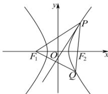

> [!faq]- 全练一本通解析
> **【答案】** B
>
> **【解析】**
> 解析:如图, 设 $F_{1}$ 关于 $\angle F_{1}PF_{2}$ 平分线的对称点为 Q, 则该角平分线为线段 $F_{1}Q$ 的垂直平分线,
> $$
> \left| P F _ {1} \right| = \left| P Q \right|
> $$
> $$
> P, F _ {2}, Q \text {三}
> $$
> $$
> \left| P F _ {1} \right| = m, \left| P F _ {2} \right| = n
> $$
> $$
> \left| P Q \right| = m, m - n = 2 a \Rightarrow \left| Q F _ {2} \right| = \left| P Q \right| - n = m - n = 2 a
> $$
> $$
> \left| Q F _ {1} \right| = 2 a + \left| Q F _ {2} \right| = 4 a
> $$
> 在 $\triangle PF_{1}Q$ 中，由余弦定理，得
> $$
> \cos \angle F _ {1} P F _ {2} = \frac {\left| P F _ {1} \right| ^ {2} + \left| P Q \right| ^ {2} - \left| Q F _ {1} \right| ^ {2}}{2 \left| P F _ {1} \right| \left| P Q \right|} = \frac {m ^ {2} + m ^ {2} - (4 a) ^ {2}}{2 m ^ {2}},
> $$
> 又 $\cos\angle F_{1}PF_{2}=\frac{1}{9}$ ，所以 $\frac{m^{2}+m^{2}-(4a)^{2}}{2m^{2}}=\frac{1}{9}$ ，解得 m=3a，所以 n=a，在 $\triangle F_{1}PF_{2}$ 中，由余弦定理，得
> $\cos \angle F_{1}PF_{2} = \frac{\left|PF_{1}\right|^{2} + \left|PF_{2}\right|^{2} - \left|F_{1}F_{2}\right|^{2}}{2\left|PF_{1}\right|\left|PF_{2}\right|} = \frac{9a^{2} + a^{2} - 4c^{2}}{2\cdot 3a^{2}} = \frac{1}{9},$ 整理，得 $3c^2 = 7a^2$ ，由 $e > 1$ ，解得 $e = \frac{c}{a} = \frac{\sqrt{21}}{3}$ 即双曲线的离心率为. $\frac{\sqrt{21}}{3}$ 故选：B
> 
