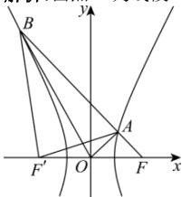

> [!faq]- 全练一本通解析
> **【解析】**
> $\frac{\sqrt{19}}{2}$
> 解析:由点 A 为线段 BF 上靠近点 F 的五等分点,
> 
> 不妨设 $\left|AF\right|=m$ ，则 $\left|BF\right|=5m,\left|BA\right|=4m$ ，连接 $BF',AF'$
> 由双曲线的定义可知， $\left|AF'\right|=m+2a,\left|BF'\right|=5m-2a$
> 由 $\triangle OAF$ 是以 $A$ 为顶点的直角三角形可知， $\angle OAF = 90^{\circ}$ ，
> 则 $\cos \angle OFA = \frac{|AF|}{|OF|} = \frac{m}{c}$ ①.
> 在 $\triangle AFF'$ 中， $\cos \angle OFA = \frac{\left|FF'\right|^2 + |AF|^2 - \left|AF'\right|^2}{2|FF'|\cdot|AF|} = \frac{4c^2 + m^2 - (m + 2a)^2}{2 \cdot 2c \cdot m}$ ②，
> $$
> \triangle B F F ^ {\prime}
> $$
> 中， $\cos \angle OFA = \cos \angle F'FB = \frac{\left|FF'\right|^2 + |BF|^2 - \left|BF'\right|^2}{2\left|FF'\right| \cdot |BF|} = \frac{4c^2 + 25m^2 - (5m - 2a)^2}{2 \cdot 2c \cdot 5m}$
> - **③**：,
> 由①②得 $\frac{c^2 - a^2 - ma}{c \cdot m} = \frac{m}{c}$ , 所以 $c^2 - a^2 = m^2 + ma$ ;
> 由①③得 $\frac{c^{2}-a^{2}+5ma}{5c\cdot m}=\frac{m}{c}$ ，所以 $c^{2}-a^{2}=5m^{2}-5ma$
> 所以 $m^{2} + ma = 5m^{2} - 5ma$ ，解得 $m = \frac{3}{2}a$ ，
> 所以 $c^2 - a^2 = \frac{9}{4} a^2 + \frac{3}{2} a^2 = \frac{15}{4} a^2$
> 所以 $c^2 = \frac{19}{4} a^2$ ，故 $e = \frac{c}{a} = \sqrt{\frac{19}{4}} = \frac{\sqrt{19}}{2}$ .故答案为： $\frac{\sqrt{19}}{2}$
