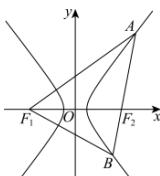

> [!faq]- 全练一本通解析
> **【解析】**
> 4
> 解析:设双曲线 C 的方程为 $\frac{x^{2}}{a^{2}} - \frac{y^{2}}{b^{2}} = 1 (a > 0, b > 0)$ ,
> 
> 因为 $\left|AF_{1}\right|+\left|BF_{1}\right|-\left|AB\right|=\left|AF_{1}\right|-\left|AF_{2}\right|+\left|BF_{1}\right|-\left|BF_{2}\right|=2a+2a=4$ ，所以a=1，
> 又 $\left|F_{1}F_{2}\right|=2c=8$ ，所以c=4，所以 $\frac{c}{a}=4$ 。故答案为：4.
