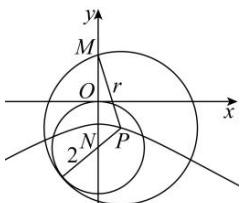

> [!faq]- 全练一本通解析
> **【答案】** A
>
> **【解析】**
> 解析: 圆 $N: x^{2} + (y + 2)^{2} = 4$ 的圆心为 $N(0, -2)$ ，半径为 2，且 $|MN| = 4$ 设动圆 P 的半径为 r，则 $\left|PM\right| = r, \left|PN\right| = r - 2$ ，即 $\left|PM\right| - \left|PN\right| = 2 < \left|MN\right|$ .
> 即点 P 在以 M, N 为焦点, 焦距长为 2c = 4, 实轴长为 2a = 2,
> 虚轴长为 $2b = 2\sqrt{4 - 1} = 2\sqrt{3}$ 的双曲线上, 且点 P 在靠近于点 N 这一支上,
> 故动圆圆心 P 的轨迹方程是 $y^{2}-\frac{x^{2}}{3}=1(y<0)$ 故选：A
> 
