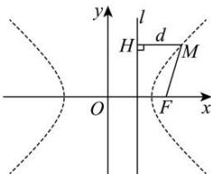

> [!faq]- 全练一本通解析
> **【答案】** 点 $M$ 轨迹是焦点在 $x$ 轴上，实轴长为 6、虚轴长为 $2\sqrt{7}$ 的双曲线 $\frac{x^{2}}{9} - \frac{y^{2}}{7} = 1$ 。
>
> **【解析】**
> 设 $d$ 是点 $M$ 到直线 $l$ 的距离，根据题意，动点 $M$ 的轨迹就是点的集合 $P = \left\{M \left| \frac{|MF|}{d} = \frac{4}{3} \right. \right\}$ ，则 $\frac{\sqrt{(x - 4)^{2} + y^{2}}}{|x - \frac{9}{4}|} = \frac{4}{3}$ 。
> 将上式两边平方，并化简，得 $7x^{2} - 9y^{2} = 63$ ，即 $\frac{x^{2}}{9} - \frac{y^{2}}{7} = 1$ 。
> 所以，点 $M$ 的轨迹是焦点在 $x$ 轴上，实轴长为 6、虚轴长为 $2\sqrt{7}$ 的双曲线 $\frac{x^{2}}{9} - \frac{y^{2}}{7} = 1$ 。
> 
