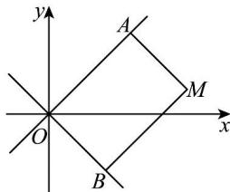

> [!faq]- 全练一本通解析
> **【答案】** C
>
> **【解析】**
> $x^{2} - y^{2} = 8(x > 0)$
> 解析: 设 $M(x,y)$ ，根据题意可知点 M 在 y = x 和 y = -x 相交的右侧区域，
> 
> 所以点 M 到直线 y = x 的距离 $d_{1} = \frac{|x - y|}{\sqrt{2}} = \frac{x - y}{\sqrt{2}}$ ,
> 到直线 y = -x 的距离 $d_{2}=\frac{|x+y|}{\sqrt{2}}=\frac{x+y}{\sqrt{2}}$ $S_{OAMB}=d_{1}d_{2}=\frac{x^{2}-y^{2}}{2}=4$ ，即 $x^{2}-y^{2}=8(x>0)$ .
> 所以动点 M 的轨迹方程： $x^{2}-y^{2}=8(x>0)$ .
>
> 故选 **C**.
