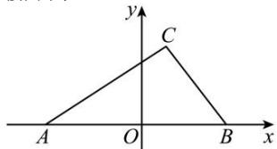

> [!faq]- 全练一本通解析
> **【答案】** $\frac{x^{2}}{2}-\frac{y^{2}}{6}=1(x>\sqrt{2})$
>
> **【解析】**
> 以AB边所在的直线为x轴,AB的垂直平分线为y轴,建立平面直角坐标系,
> 如图所示, 则 $A\left(-2\sqrt{2},0\right)$ , $B\left(2\sqrt{2},0\right)$ .
> 由正弦定理, 得 $\sin A = \frac{|BC|}{2R}$ , $\sin B = \frac{|AC|}{2R}$ , $\sin C = \frac{|AB|}{2R}$ (R 为 $\triangle ABC$ 的外接圆半径).
> 
> ∵ $2\sin A + \sin C = 2\sin B$ ,
> ∴ $2|BC| + |AB| = 2|AC|$ ，即 $|AC| - |BC| = \frac{|AB|}{2} = 2\sqrt{2} < |AB|$ .
> 由双曲线的定义知, 点 C 的轨迹为双曲线的右支 (除去与 x 轴的交点).
> 由题意, 设所求轨迹方程为 $\frac{x^{2}}{a^{2}} - \frac{y^{2}}{b^{2}} = 1 (x > a)$ ,
> $\because a = \sqrt{2}, c = 2\sqrt{2}, \therefore b^{2} = c^{2} - a^{2} = 6.$
> 故所求轨迹方程为 $\frac{x^{2}}{2}-\frac{y^{2}}{6}=1(x>\sqrt{2})$ .
