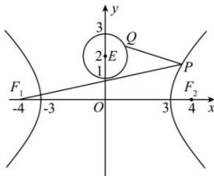

<!-- question-source:start -->
【42】（2023）已知双曲线 $C:\frac{x^{2}}{9}-\frac{y^{2}}{7}=1$ ， $F_{1}, F_{2}$ 是其左右焦点。圆 $E:x^{2}+y^{2}-4y+3=0$ ，点P为双曲线C右支上的动点，点Q为圆E上的动点，则 $\left|PQ\right|+\left|PF_{1}\right|$ 的最小值是\_\_\_\_。

<!-- question-source:end -->

![[Q00008108A1]]
