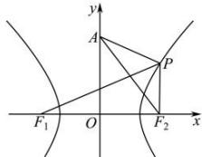

> [!faq]- 全练一本通解析
> **【答案】** C
>
> **【解析】**
> 解析:由双曲线 $\frac{x^{2}}{4}-\frac{y^{2}}{5}=1$ ，则 $a^{2}=4, b^{2}=5$ ，即 $c^{2}=a^{2}+b^{2}=9$ ，且 $F_{1}(-3,0), F_{2}(3,0)$ ，
> 由题意，作图如下：
> 
> $\left|PA\right| + \left|PF_{1}\right| = \left|PA\right| + 2a + \left|PF_{2}\right|\geq \left|AF_{2}\right| + 2a = \sqrt{3^{2} + 4^{2}} +4 = 9$ 当且仅当 $A,P,F_{2}$ 共线时，等号成立.
>
> 故选 **C**.
