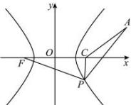

> [!faq]- 全练一本通解析
> **【答案】** D
>
> **【解析】**
> 解析: 若 C 为双曲线右焦点 C（3,0），则 $\left|PF\right| - \left|PC\right| = 2a = 4$ ， $\left|AC\right| = 5$
> 
> 而 $\left|PA\right|\geq\left|PC\right|-\left|AC\right|$ ，仅当P,C,A共线且A在P,C之间时等号成立，
> 所以 $\left|PF\right| - \left|PA\right| \leq \left|PF\right| - \left|PC\right| + \left|AC\right| = 4 + 5 = 9$
> $$
> A \text {在} P, C
> $$
