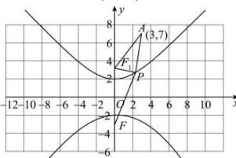

> [!faq]- 全练一本通解析
> **【答案】** D
>
> **【解析】**
> 解析:由题意得双曲线焦点在 y 轴上， $a^{2}=4,\ b^{2}=5,\ c^{2}=a^{2}+b^{2}=9$ 所以下焦点 $F(0,-3)$ ，设上焦点为 $F_{1}$ ，则 $F_{1}(0,3)$ ，
> 
> 根据双曲线定义： $\left\|PF\right|-\left|PF_{1}\right|=2a=4,\because P$ 在上支， $\therefore\left|PF\right|-\left|PF_{1}\right|=2a=4$ $\left|PF\right|=4+\left|PF_{1}\right|,\left|PF\right|-\left|PA\right|=4+\left|PF_{1}\right|-\left|PA\right|,$ 在 $\triangle PF_{1}A$ 中两边之差小于第三边， $\therefore\left|PF_{1}\right|-\left|PA\right|\geq-\left|AF_{1}\right|,$ $\left|AF_{1}\right|=\sqrt{(3-0)^{2}+(7-3)^{2}}=5,$ $\therefore\left|PF\right|-\left|PA\right|\geq4-5=-1.$
>
> 故选 **D**.
