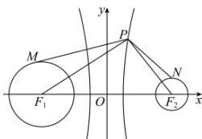

> [!faq]- 全练一本通解析
> **【解析】**
> 5
> 解析: 双曲线的两个焦点 $F_{1}(-4,0)$ ， $F_{2}(4,0)$ 分别为两圆的圆心，
> 
> 两圆的半径分别为 $r_1 = 2$ ， $r_2 = 1$ ，易知 $\left|PM\right|_{\max} = \left|PF_1\right| + 2$ ， $\left|PN\right|_{\min} = \left|PF_2\right| - 1$ 故 $\left|PM\right| - \left|PN\right|$ 的最大值为 $\left|PF_1\right| + 2 - \left(\left|PF_2\right| - 1\right) = \left|PF_1\right| - \left|PF_2\right| + 3 = 2 + 3 = 5$ 故答案为：5
