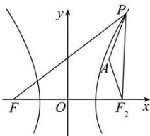

> [!faq]- 全练一本通解析
> **【答案】** $4 + \sqrt{10} /\sqrt{10} +4$
>
> **【解析】**
> 如图，设双曲线的右焦点为 $F_{2}(4,0)$ ，由题知 $a = 2,b = 2\sqrt{3},c = 4$ 因为 $\left|PF\right| - \left|PF_2\right| = 2a = 4$ ，所以 $\left|PF\right| = 4 + \left|PF_2\right|$ 因为 $A(3,3)$ ， $\left|PF_2\right| - \left|PA\right|\leq \left|AF_2\right| = \sqrt{10}$ ，当且仅当 $P,A,F_{2}$ 三点共线时等号成立，所以， $\left|PF\right| - \left|PA\right| = 4 + \left|PF_2\right| - \left|PA\right|\leq 4 + \left|AF_2\right| = 4 + \sqrt{10}$ ，当且仅当 $P,A,F_{2}$ 三点共线时等号成立.所以， $\left|PF\right| - \left|PA\right|$ 的最大值为 $4 + \sqrt{10}$ 故答案为： $4 + \sqrt{10}$
> 
