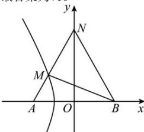

> [!faq]- 全练一本通解析
> **【解析】**
> 10
> 解析:动点 M 的轨迹为双曲线 $x^{2}-\frac{y^{2}}{3}=1$ 的左
> 支， $\left|NB\right|=\sqrt{\left(2\sqrt{3}\right)^{2}+2^{2}}=4$ ， $\triangle MNB$ 的周长最小时， $\left|MN\right|+\left|MB\right|$ 最小， $\left|MN\right|+\left|MB\right|=\left|MN\right|+\left|MA\right|+2$ ，又 $\left|MN\right|+\left|MA\right|\geq\left|AN\right|=4$ 当且仅当 N, M, A 三点共线且 M 在线段 AN 上时，等号成立，
> ∴△MNB 的周长为 $\left|MN\right|+\left|MB\right|+\left|NB\right|=\left|MN\right|+\left|MA\right|+2+4\geq\left|AN\right|+6=10$
> $$
> \text {为}: 1 0
> $$
> 
