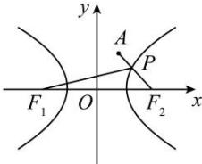

> [!faq]- 全练一本通解析
> **【答案】** $4\sqrt{2}+\sqrt{13}$
>
> **【解析】**
> 如图所示,
> 
> $$
> a = 2 \sqrt {2}, c = 4, F _ {2} (4, 0)
> $$
> $$
> \left| P F _ {1} \right| - \left| P F _ {2} \right| = 2 a = 4 \sqrt {2}
> $$
> $$
> \left| P F _ {1} \right| = 4 \sqrt {2} + \left| P F _ {2} \right|
> $$
> $\left|PF_{1}\right|+\left|PA\right|=4\sqrt{2}+\left|PF_{2}\right|+\left|PA\right|,$ 当 $P, A, F_{2}$ 三点共线时， $\left|PF_{2}\right|+|PA|$ 最小为 $\left|AF_{2}\right|=\sqrt{(4-1)^{2}+(0-2)^{2}}=\sqrt{13}$ 故 $\left(\left|PF_{1}\right|+\left|PA\right|\right)_{\min}=4\sqrt{2}+\left|AF_{2}\right|=4\sqrt{2}+\sqrt{13}$ 故答案为： $4\sqrt{2}+\sqrt{13}$
