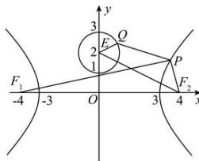

> [!faq]- 全练一本通解析
> **【答案】** $5+2\sqrt{5}$
>
> **【解析】**
> 由题设知， $F_{1}(-4,0)$ ， $F_{2}(4,0)$ ， $E(0,2)$ ，圆E的半径r=1
> 由点P为双曲线C右支上的动点知 $\left|PF_{1}\right|=\left|PF_{2}\right|+6$ $\therefore \left|PF_{1}\right| + \left|PQ\right| = \left|PF_{2}\right| + \left|PQ\right| + 6$ $\therefore$ $\left(\left|PF_{1}\right|+\left|PQ\right|\right)_{\min}=\left(\left|PF_{2}\right|+\left|PQ\right|\right)_{\min}+6=\left|F_{2}E\right|-r+6=2\sqrt{5}-1+6=5+2\sqrt{5}.$ 故答案为： $5+2\sqrt{5}$
> 
