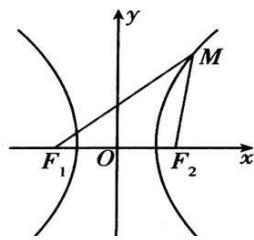

## 1. 双曲线的定义

（1）双曲线定义:在平面内与两个定点 $F_{1}$ 、 $F_{2}$ 的距离之差的绝对值等于非零常数（小于 $\left|F_{1}F_{2}\right|$ ）的点的轨迹叫做双曲线.这两个定点叫双曲线的焦点，两焦点间的距离叫作双曲线的焦距，焦距的一半叫作半焦距.

（2）双曲线定义的集合语言表示： $P = \left\{M\left\| MF_1\right| - \left|MF_2\right| = 2a,0 <   2a <   \left|F_1F_2\right|\right\}$

注意：

（1）双曲线的定义中，常数 $2a$ 应当满足的约束条件： $\left\| PF_1\right| - \left|PF_2\right| = 2a < \left|F_1F_2\right|$ ，这可以借助于三角形中边的相关性质“两边之差小于第三边”来理解；

（2）若去掉定义中的“绝对值”，常数 $a$ 满足约束条件： $\left|PF_1\right| - \left|PF_2\right| = 2a < \left|F_1F_2\right|$ （ $a > 0$ ），则动点轨迹仅表示双曲线中靠焦点 $F_{2}$ 的一支；若 $\left|PF_2\right| - \left|PF_1\right| = 2a < \left|F_1F_2\right|$ （ $a > 0$ ），则轨迹仅表示双曲线中靠焦点 $F_{1}$ 的一支；

（3）若常数 a 满足约束条件： $\left\|PF_{1}\right|-\left|PF_{2}\right|=2a=\left|F_{1}F_{2}\right|$ ，则轨迹是以 $F_{1}$ 、 $F_{2}$ 为端点的两条射线（包括端点）；

（4）若常数 $a$ 满足约束条件： $\left|PF_1\right| - \left|PF_2\right| = 2a > \left|F_1F_2\right|$ ，则动点轨迹不存在；

（5）若常数 a=0，则动点轨迹为线段 $F_{1}F_{2}$ 的垂直平分线.
