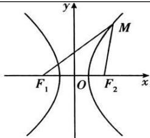
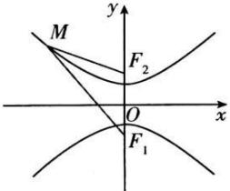

## 3. 双曲线的标准方程对比

<table><tr><td>定义</td><td colspan="2"> $||MF_1| - |MF_2|| = 2a(0 < 2a < |F_1F_2|)$ </td></tr><tr><td>图形</td><td></td><td></td></tr><tr><td>标准方程</td><td> $\frac{x^2}{a^2} - \frac{y^2}{b^2} = 1 (a > 0, b > 0)$ </td><td> $\frac{y^2}{a^2} - \frac{x^2}{b^2} = 1 (a > 0, b > 0)$ </td></tr><tr><td>焦点</td><td> $F_1(-c,0), F_2(c,0)$ </td><td> $F_1(0,-c), F_2(0,c)$ </td></tr><tr><td>a,b,c的关系</td><td colspan="2"> $c^2 = a^2 + b^2$ </td></tr></table>
