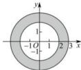

> [!faq]- 全练一本通解析
> **【答案】** （1）满足条件 $|z| = 2$ 点 $Z$ 的集合是以原点 $O$ 为圆心，以2为半径的圆 （2）以原点 $O$ 为圆心，以2和3为半径的两圆所夹的圆环，并包括圆环的边界
>
> **【解析】**
> （1）复数 $z$ 的模等于2,这表明，复数 $z$ 对应的向量 $\overline{OZ}$ 之的长度等于2,即点 $Z$ 到原点 $O$ 的距离等于2,因此满足条件 $|z| = 2$ 点 $Z$ 的集合是以原点 $O$ 为圆心，以2为半径的圆.
> （2）不等式 $2\leq |z|\leq 3$ 可以化为不等式组 $\left\{ \begin{array}{l} |z|\leq 3,\\ |z|\geq 2. \end{array} \right.$ 不等式 $|z|\leq 3$ 的解集是圆 $|z| = 3$ 和该圆内部所有的点构成的集合，不等式 $|z|\geq 2$ 的解集是圆 $|z| = 2$ 和该圆外部所有的点构成的集合，这两个集合的交集，即上述不等式组的解集，也就是满足条件 $2\leq |z|\leq 3$ 的点 $Z$ 的集合.
> 所求的集合是以原点 $O$ 为圆心，以2和3为半径的两圆所夹的圆环，并包括圆环的边界.
> 
