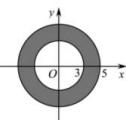

> [!faq]- 全练一本通解析
> **【答案】** C
>
> **【解析】**
> 解析: 满足条件 $\left|z\right|=3$ 的复数 z 在复平面内对应的点的轨迹是以原点为圆心, 半径为 3 的圆,
> 满足条件 $\left|z\right|=5$ 的复数 z 在复平面内对应的点的轨迹是以原点为圆心,
> 半径为 5 的圆,
> 则在复平面内 $3 \leq |z| \leq 5$ 所表示的区域为圆环, 如下图阴影区域所示:
> 
> 在复平面内 $3 \leq |z| \leq 5$ 所表示的区域的面积是 $\pi \times (5^2 - 3^2) = 16\pi$ 。
>
> 故选 **C**.
