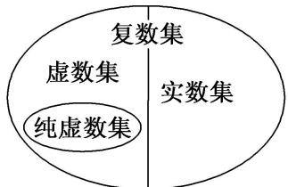

## 3. 复数的分类

对于复数 $a + bi$

（1）当且仅当b=0时,它是实数;

（2）当且仅当 $a = b = 0$ 时，它是实数0；

（3）当 $b\neq0$ 时,叫做虚数;

（4）当a=0且 $b\neq0$ 时,叫做纯虚数.

这样, 复数 $z = a + bi$ 可以分类如下: 复数 $a + bi\left\{\begin{aligned}\text{实数}a(b=0)\\ \text{虚数}a+bi(b\neq0)\end{aligned}\right.\left\{\begin{aligned}\text{纯虚数}bi(a=0)\\ \text{非纯虚数}a+bi(a\neq0)\end{aligned}\right.$

【注意】复数集、实数集、虚数集、纯虚数集之间的关系

