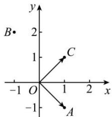

<!-- question-source:start -->
【34】已知复数 $z_{1}=1-\mathrm{i},z_{2}=-1+2\mathrm{i}$ （i为虚数单位）在复平面内对应的点分别为A,B，将向量 $\overrightarrow{OA}$ 绕着点O（O为复平面内的原点）逆时针旋转90°得到向量 $\overrightarrow{OC}$ ，则 $\overrightarrow{OC}+\overrightarrow{OB}$ 对应的复数为（）

A. $-1 + 2\mathrm{i}$ B. $2\mathrm{i}$ C. $3\mathrm{i}$ D. $1 - 2\mathrm{i}$
<!-- question-source:end -->

![[Q00008772A1]]
