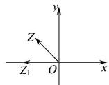

> [!faq]- 全练一本通解析
> **【答案】** A
>
> **【解析】**
> 解析:如图,由题意可知 $\overline{OZ}=(-1,1)$ , $\overline{OZ}$ 与 x 轴夹角为 $\frac{3}{4}\pi$ ,
> 绕点 O 逆时针方向旋转 $\frac{\pi}{4}$ 后 Z 到达 x 轴上 $Z_{1}$ 点,
> 又 $\left|\overline{OZ_{1}}\right|=\left|\overline{OZ}\right|=\sqrt{2}$ , 所以 $Z_{1}$ 的坐标为 $(- \sqrt{2},0)$ ,
> 所以 $\overline{OZ_{1}}$ 对应的复数为 $-\sqrt{2}$ . 故选:A.
> 
