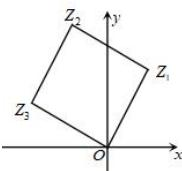

> [!faq]- 全练一本通解析
> **【答案】** $-2\sqrt{3}-2i$
>
> **【解析】**
> 设 $Z_{3}$ 对应的复数为 $z_{3}$ ，可得 $\left|z_{3}\right|=\left|z_{1}\right|=2$ ，
> 
> 复平面上点 $Z_{1}$ 与 $x$ 轴正半轴的夹角为 $\frac{\pi}{3}$ ，则点 $Z_{3}$ 与 $x$ 轴正半轴的夹角为 $\frac{5\pi}{6}$ ，所以 $z_{3} = 2\left(\cos \frac{5\pi}{6} + \mathrm{i} \cdot \sin \frac{5\pi}{6}\right) = -\sqrt{3} + \mathrm{i}$ ，所以 $z_{3}z_{1} = (-\sqrt{3} + \mathrm{i})(1 + \sqrt{3}\mathrm{i}) = -2\sqrt{3} - 2\mathrm{i}$ 。故答案为： $-2\sqrt{3} - 2\mathrm{i}$ 。
