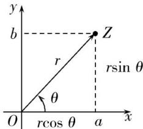

## 2. 复数的三角表达式

一般地, 如果非零复数 $z = a + b\mathrm{i}(a,b \in \mathbf{R})$ 在复平面内对应点 $Z(a,b)$ , 且 $r$ 为向量 $\overrightarrow{OZ}$ 的模, $\theta$ 为复数的辅角, 则 $r = |z| = \sqrt{a^2 + b^2}, a = r\cos \theta, b = r\sin \theta$ , 从而 $z = a + b\mathrm{i} = r(\cos \theta + \mathrm{i}\sin \theta)$ , 式子中的 $r(\cos \theta + \mathrm{i}\sin \theta)$ 称为非零复数 $z = a + b\mathrm{i}$ 的三角形式（对应地, $a + b\mathrm{i}$ 称为复数的代数形式）, 其中的 $\theta$ 称为 $z$ 的辐角. 如图所示.

【注意】复数的三角形式必须满足:模非负,角相同,余正弦,加号连.
