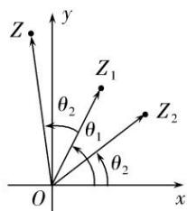

## 3. 复数乘法的三角表示及几何意义

（1）复数乘法法则：

设 $z_{1} = r_{1}\left(\cos \theta_{1} + i\sin \theta_{1}\right),z_{2} = r_{2}\left(\cos \theta_{2} + i\sin \theta_{2}\right)$

$$
z _ {1} z _ {2} = r _ {1} \left(\cos \theta_ {1} + \mathrm{i} \sin \theta_ {1}\right) \times r _ {2} \left(\cos \theta_ {2} + \mathrm{i} \sin \theta_ {2}\right) = r _ {1} r _ {2} \left[ \cos \left(\theta_ {1} + \theta_ {2}\right) + \mathrm{i} \sin \left(\theta_ {1} + \theta_ {2}\right) \right]
$$

(2) 文字语言:

两个复数 $z_{1}, z_{2}$ 相乘， $z_{1}$ 的模乘以 $z_{2}$ 的模等于 $z_{1}z_{2}$ 的模， $z_{1}$ 的辐角与 $z_{2}$ 的辐角之和是 $z_{1}z_{2}$ 的辐角.

（3）复数相乘的几何意义：

设 $z_{1}, z_{2}$ 对应的向量分别为 $\overrightarrow{OZ}_{1}, \overrightarrow{OZ}_{2}$ ，将 $\overrightarrow{OZ}_{1}$ 绕原点按逆时针方向旋转角 $\theta_{2}$ ，再将 $\overrightarrow{OZ}_{1}$ 的模变为原来的 $r_{2}$ 倍，如果所得向量为 $\overrightarrow{OZ}$ ，则 $\overrightarrow{OZ}$ 对应的复数即为 $z_{1}z_{2}$ ，如图所示.

