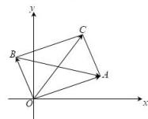

> [!faq]- 全练一本通解析
> **【答案】** AD
>
> **【解析】**
> 解析：
> 如图所示, 由向量的加法及减法法则可知 $\overrightarrow{OC} = \overrightarrow{OA} + \overrightarrow{OB}$ , $\overrightarrow{BA} = \overrightarrow{OA} - \overrightarrow{OB}$ , 又由复数加法及减法的几何意义可知 $|z_1 + z_2|$ 对应 $\overrightarrow{OC}$ 的模, $|z_1 - z_2|$ 对应 $\overrightarrow{BA}$ 的模,
> 因为 $\left|z_1 + z_2\right| = \left|z_1 - z_2\right|$ ，所以四边形 $OACB$ 是矩形，则 $\overrightarrow{OA}\perp \overrightarrow{OB}$
> 又因为线段 $AB$ 的中点 $M$ 对应的复数为 $4 + 3\mathrm{i}$ ，所以 $|\overrightarrow{AB}| = 2|\overrightarrow{OM}| = 10$ 所以 $\left|z_1\right|^2 +\left|z_2\right|^2 = \left|\overrightarrow{OA}\right|^2 +\left|\overrightarrow{OB}\right|^2 = \left|\overrightarrow{AB}\right|^2 = 100$ 故选：AD.
> 
