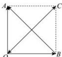

> [!faq]- 全练一本通解析
> **【答案】** $3\sqrt{2}$
>
> **【解析】**
> 设 $\overrightarrow{OA}$ 对应的复数为 $z_{1}$ ， $\overrightarrow{OB}$ 对应的复数为 $z_{2}$ ，
> 则 $\overrightarrow{OA} +\overrightarrow{OB}$ 对应的复数为 $z_{1} + z_{2}$ ， $\overrightarrow{OA} -\overrightarrow{OB}$ 对应的复数为 $z_{1} - z_{2}$
> 因为 $\left|z_{1}\right|=\left|z_{2}\right|=3$ ，且 $\left|z_{1}-z_{2}\right|=3\sqrt{2}$ ，
> 所以 $\triangle AOB$ 为等腰直角三角形, 且 $\left|\overrightarrow{BA}\right|=3\sqrt{2}$ .
> 
> 作正方形 AOBC, 如图所示, 则 $\overrightarrow{OA} + \overrightarrow{OB} = \overrightarrow{OC}$ 对应的复数为 $z_{1} + z_{2}$ , 故 $\left|z_{1} + z_{2}\right| = \left|\overrightarrow{OC}\right| = \left|\overrightarrow{BA}\right| = 3\sqrt{2}$ . 故答案为: $3\sqrt{2}$ .
