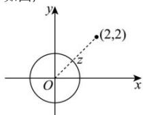

> [!faq]- 全练一本通解析
> **【答案】** B
>
> **【解析】**
> 解析: 设 $z = a + bi$ , $\because |z| = 1$ ,
> 则复数 z 对应的点 $Z(a,b)$ 在以原点为圆心, 以 1 为半径的圆上, 如图,
> 
> $\because |z - 2 - 2\mathrm{i}| = |z - (2 + 2\mathrm{i})|$ 的几何意义是点 $Z(a,b)$ 到点(2,2)的距离， $\therefore |z - 2 - 2\mathrm{i}| = |z - (2 + 2\mathrm{i})|$ 的最小值是复数 $2 + 2\mathrm{i}$ 对应的点(2,2)到原点的距离减去半径1，∴即 $\sqrt{2^2 + 2^2} - 1 = 2\sqrt{2} - 1$
>
> 故选 **B**.
