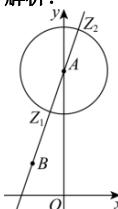

> [!faq]- 全练一本通解析
> **【答案】** $\left[\sqrt{10} - 2, \sqrt{10} + 2\right]$
>
> **【解析】**
> 
> 由 $\left|z-4i\right|=2$ 可知, 复数 z 对应的点 Z 在以点 $A(0,4)$ 为圆心, 半径为 2 的圆上, 而 $\left|z+1-i\right|$ 可理解为圆上的点 Z 到点 $B(-1,1)$ 的距离 BZ,
> 作直线 AB，交圆于点 $Z_{1}, Z_{2}$ ，如图所示.
> 显然, 当点 Z 与点 $Z_{2}$ 重合
> 时， $BZ_{\max}=AB+2=\sqrt{(-1)^{2}+(4-1)^{2}}+2=\sqrt{10}+2$
> 当点 $Z$ 与点 $Z_{1}$ 重合时， $BZ_{\min} = AB - 2 = \sqrt{(-1)^2 + (4 - 1)^2} - 2 = \sqrt{10} - 2$ 。
> 即 $\left|z+1-i\right|$ 的取值范围是 $\left[\sqrt{10}-2,\sqrt{10}+2\right]$ .
> 故答案为： $\left[\sqrt{10} -2,\sqrt{10} +2\right]$
