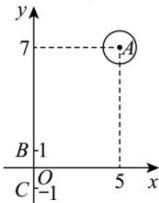

> [!faq]- 全练一本通解析
> **【答案】** 6
>
> **【解析】**
> 由 $\left|z_{1}-5-7i\right|=1$ 可知, $z_{1}$ 对应的点是以 $A(5,7)$ 为圆心, 1 为半径的圆.
> 由 $\left|z_{2}+i\right|=\left|z_{2}-i\right|$ 可知， $z_{2}$ 对应的点是以 $B(0,1)$ ， $C(0,-1)$ 为端点的线段BC的垂直平分线，也就是x轴.
> $\left|z_{1}-z_{2}\right|$ 为圆上一点与 x 轴上一点的距离的最小值, 即为圆心到 x 轴的距离减去半径为 6. 故答案为: 6.
> 
