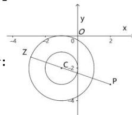

> [!faq]- 全练一本通解析
> **【答案】** A
>
> **【解析】**
> 解析：
> 
> 如图, 由复数的模的几何意义可知,
> 满足 $1 \leq |z + 1 + 2\mathrm{i}| \leq 2$ 的点 $Z$ 的轨迹是以点 $C(-1, -2)$ 为圆心，半径分别为1和2的两个圆组成的圆环内的区域（含内外圆弧）.
> 而 $|z - 2 + 3\mathrm{i}|$ 可理解为圆环区域内的点（含内外圆弧）到点 $P(2, - 3)$ 的距离 $d$ ：
> 由点与圆的位置关系可知, 当且仅当点 Z 在线段 PC 的延长线与大圆的交点处时, 距离 d 取得最大,
> 为 $d_{\mathrm{max}} = \left|PC\right| + 2 = \sqrt{(2 + 1)^2 + (-3 + 2)^2} = 2 + \sqrt{10}$ ，即 $\left|z - 2 + 3\mathrm{i}\right|$ 的最大值为 $2 + \sqrt{10}$ .
>
> 故选 **A**.
