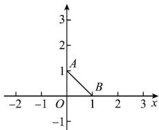

> [!faq]- 全练一本通解析
> **【答案】** $\sqrt{2}$
>
> **【解析】**
> 设 $z = x + yi$
> 因为 $|z + 1| - |z - 1| = 2$ ，所以 $\sqrt{(x + 1)^2 + y^2} -\sqrt{(x - 1)^2 + y^2} = 2$
> 即点 $(x,y)$ 到点 $(-1,0)$ 和 $(1,0)$ 的距离之差等于2,
> 所以在复平面内点 $Z$ 表示射线 $y = 0(x\geq 1)$
> $|z-i|$ 的几何意义表示点 Z 到 $(0,1)$ 的距离.
> 由图可知， $|z - \mathrm{i}|$ 的最小值为 $\left|AB\right| = \sqrt{2}$
> 
